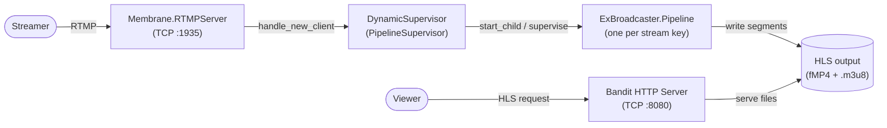
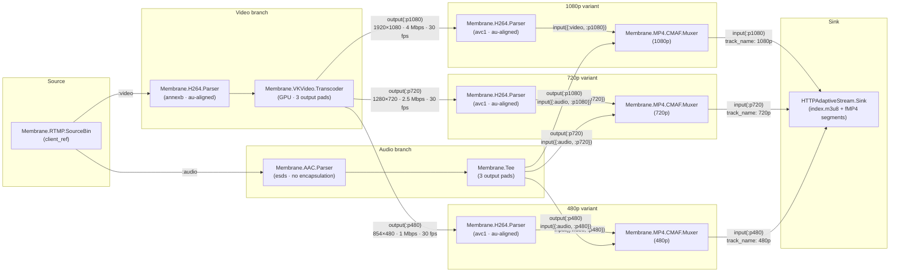

Bringing Membrane to production

This article is the first in a series of articles about building a fully functional multimedia processing solution using Membrane Framework. Stay tuned for the forthcoming ones!

Together we will build a system capable of ingesting stream (RTMP stream at very first), transcoding it to different resolutions to ensure it’s watchable even by viewers with poor network performance and distributing it globally with the use of HLS (HTTP Live Stream). 
This type of system is a backbone of many applications, for instance Twitch. It allows broadcasting the user generated content (gameplay etc.) to thousands of viewers spread across the globe simultaneously and with the lowest streamer -> viewer latency possible. These types of system are also commonly offered as SaaS (e.g. AWS IVS - Interactive Video Service) so that developers can embed them in their own applications.
Building such a broadcasting system faces multiple challenges and assuring its reliability requires a lot of time and effort. We will however show that a basic version of it can be built in Elixir, with the use of Membrane Framework and that even such a simple system can successfully run in production, effectively utilizing cloud resources, capable of scaling up with increased demand. 


Below there is a list of steps we need to take to achieve this goal:

1. **Build the multimedia processing pipeline using Membrane Framework** — Using components already available in the Membrane Framework we will build a simple pipeline which will ingest RTMP stream, transcode it with the use of hardware acceleration to effectively utilize GPU resources into multiple resolutions with different bandwidth and put all stream versions into fragmented MP4 containers (being a “Common Media Application Format” - CMAF - format) and generate a `.m3u8` multi-variant playlist to allow the player at the viewer side to decide which resolution to choose depending on network conditions.
2. **Wrap the pipeline into an Elixir application** to take advantage of supervision trees and configuration capabilities
3. **Prepare a release of the application**
4. **Ensure application scalability** with the use of clustering on K8s
5. **Deploy the application** in a cloud environment, with appropriate configuration of runners to take advantage of GPU encoding and decoding
6. **Configure cloud CDN** to ensure smooth broadcasting of the stream
7. **Add metrics**


# Prerequisites
In this chapter we will create an Elixir application and run it locally. Since the application will be performing hardware-accelerated video transcoding with the use of Vulkan Video Extensions, you need a Linux machine with a Vulkan-capable GPU (NVIDIA or AMD) with Mesa drivers and Vulkan Video extension support.

For more information, you can take a look at [vk-video](https://crates.io/crates/vk-video) Rust package which delivers hardware-accelerated transcoding capabilities, which Membrane element uses under the hood.
In the next chapters we will focus on deploying the application in the cloud environment so you won’t need to run the application locally, so this requirement won’t apply anymore.

If you are new to Membrane, please take a look at the [Getting Started with Membrane](https://hexdocs.pm/membrane_core/01_introduction-2.html) guide as it presents basic Membrane concepts and shows how to write your own simple pipelines - we won’t discuss these things in detail in this tutorial.
For development purposes, make sure you have FFmpeg installed.

# System overview

The application is a standard Elixir OTP application built around three top-level processes started by the supervisor:

- **`Membrane.RTMPServer`** — a TCP server listening on the configured RTMP port. Each time a new client connects it calls `handle_new_client/3`, which decides whether to accept the stream.
- **`DynamicSupervisor`** — manages one `ExBroadcaster.Pipeline` process per active stream. Pipelines are started on demand when a client connects and are supervised independently (`:one_for_one`), so a crash in one pipeline does not affect others. The number of concurrently running pipelines is bounded by `max_concurrent_pipelines`.
- **`Bandit` HTTP server** — serves the HLS playlist files and fMP4 segments written to disk by the pipelines, so viewers can play back the stream.

Each pipeline is entirely self-contained: it owns the full processing chain from RTMP ingestion through GPU-accelerated transcoding to HLS segment writing. Pipelines for different stream keys write to separate output directories and operate without any shared mutable state.



# Creating a new project
Let’s start by creating a new `mix` project with the name of your choice:
```
mix new ex_broadcaster
```
It will create a template of a Mix project with the basic application structure. 

## Dependencies
In `mix.exs` add the required dependencies:
```elixir
defp deps do 
	[
      {:membrane_core, "~> 1.2"},
      {:membrane_vk_video_plugin, "~> 0.2.1"},
      {:membrane_rtmp_plugin, "~> 0.29.3"},
      {:membrane_http_adaptive_stream_plugin, "~> 0.21.0"},
      {:membrane_mp4_plugin, "~> 0.36.0"},
      {:membrane_h26x_plugin, "~> 0.10.5"},
      {:membrane_aac_plugin, "~> 0.19.0"}
    ]
  end
```
We need the following packages:

- `membrane_core` — to specify the pipeline structure
- `membrane_vk_video_plugin` — providing hardware transcoding capabilities
- `membrane_rtmp_plugin` — for RTMP ingestion source
- `membrane_http_adaptive_stream_plugin` — for HLS playlist generation
- `membrane_mp4_plugin` — for wrapping stream in CMAF container
- `membrane_h26x_plugin` and `membrane_aac_plugin` — to change the stream structure of video and audio streams (so that they “fit” in CMAF container)

## Configuration
In `config/config.exs` let’s add the following entries which we will use later:
```elixir
config :ex_broadcaster,
  rtmp_port: 1935,
  hls_output_dir: "output/hls",
  segment_duration_sec: 4,
  http_port: 8080,
  max_concurrent_pipelines: 10
```
We specify the following entries:

- `rtmp_port` — (TCP) port at which RTMP server will be listening
- `hls_output_dir` — path to the directory where HLS playlist will be generated
- `segment_duration_sec` — duration of each fragmented `.mp4` CMAF segment (expressed in seconds)
- `http_port` — port at which the generated HLS playlist will be served via HTTP server
- `max_concurrent_pipelines` — limits the number of pipelines which can be run at once

The provided values are reasonable for a local development, but we will need to change them later, when we deploy the application.


# Application startup
In `lib/ex_broadcaster/application.ex` add the `start/2` function:
```
defmodule ExBroadcaster.Application do
 …
  @max_concurrent_pipelines Application.compile_env(:ex_broadcaster, :max_concurrent_pipelines, 10)

  @impl true
  def start(_type, _args) do
    rtmp_port = Application.get_env(:ex_broadcaster, :rtmp_port, 1935)
    http_port = Application.get_env(:ex_broadcaster, :http_port, 8080)

    children = [
      {Membrane.RTMPServer, port: rtmp_port, handle_new_client: &__MODULE__.handle_new_client/3},
      {DynamicSupervisor, name: __MODULE__.PipelineSupervisor, strategy: :one_for_one},
      {Bandit, plug: Broadcaster.HTTPServer, port: http_port}
    ]

    Logger.info("[App] RTMP server listening on port #{rtmp_port}")
    Logger.info("[App] HTTP server listening on port #{http_port}")

    Supervisor.start_link(children, strategy: :one_for_one, name: __MODULE__)
  end
end
```

On application startup we spawn:

- RTMP server listening on chosen port
- `DynamicSupervisor` under which we will spawn the pipelines handling particular streams. Since all its children will be independent from each other, we want it to use `:one_for_one` supervision strategy.
- `Bandit` HTTP server

We use `:one_for_one` supervision strategy to ensure that each child is restarted independently from the other. 

We define `@max_concurrent_pipelines` as a module attribute using `Application.compile_env/3` rather than `Application.get_env/3` so the value is resolved at compile time.

## RTMP Server
RTMP Server requires providing `handle_new_client` callback. It’s called each time a new client connects to the server. Let’s implement it:

```elixir
  def handle_new_client(client_ref, app, stream_key) do
    Logger.info("[App] New RTMP client: app=#{app}, stream_key=#{stream_key}")

    base_dir = Application.get_env(:ex_broadcaster, :hls_output_dir, "output/hls")
    segment_duration_sec = Application.get_env(:ex_broadcaster, :segment_duration_sec, 4)
    output_dir = Path.join(base_dir, stream_key)

    pipeline_opts = [
      client_ref: client_ref,
      output_dir: output_dir,
      segment_duration: Membrane.Time.seconds(segment_duration_sec)
    ]

    %{active: active} = DynamicSupervisor.count_children(__MODULE__.PipelineSupervisor)

    if active >= @max_concurrent_pipelines do
      Logger.warning("[App] Rejecting client (stream_key=#{stream_key}): reached limit of #{@max_concurrent_pipelines} concurrent pipelines")
    else
      case DynamicSupervisor.start_child(
             __MODULE__.PipelineSupervisor,
             {ExBroadcaster.Pipeline, pipeline_opts}
           ) do
        {:ok, _supervisor, pid} ->
          Logger.info("[App] Pipeline started (pid=#{inspect(pid)}) for stream_key=#{stream_key}")

        {:error, reason} ->
          Logger.error(“[App] Failed to start pipeline: #{inspect(reason)}”)
      end
    end

    Membrane.RTMP.Source.ClientHandlerImpl
  end
```

In this callback we assert that no more than `max_concurrent_pipelines` would be running at once after spawning a new pipeline - if not, we attempt to spawn the new pipeline under the `DynamicSupervisor` spawned in the application. We provide the desired options to the pipeline (we will talk about these options later) and check if the pipeline startup was successful.

The last thing we do is to return a module implementing the RTMP client behaviour. In many circumstances we would need to implement this behaviour on our own, but since we want to use the Membrane.RTMP.Server with `Membrane.RTMP.Source`, we return `Membrane.RTMP.Source.ClientHandlerImpl` which is a preexisting implementation meant to be used with this common case.

# Building the pipeline
Now let’s add a new module, e.g. `ExBroadcaster.Pipeline` and add a simple `start_link/1` implementation that will start the Pipeline module with passed options:
```elixir
defmodule ExBroadcaster.Pipeline do
  use Membrane.Pipeline

  require Membrane.Logger, as: Logger

  @variants [
    %{id: :p1080, track_name: "1080p", width: 1920, height: 1080, bitrate: 4_000_000, framerate: {30, 1}},
    %{id: :p720,  track_name: "720p",  width: 1280, height: 720,  bitrate: 2_500_000, framerate: {30, 1}},
    %{id: :p480,  track_name: "480p",  width: 854,  height: 480,  bitrate: 1_000_000, framerate: {30, 1}}
  ]

  def start_link(opts) do
    Membrane.Pipeline.start_link(__MODULE__, opts)
  end
end
```
Now we can start implementing Membrane pipeline callbacks.


## `handle_init` callback

Let’s start with `handle_init`:
```elixir
 @impl true
  def handle_init(_ctx, opts) do
    client_ref = Keyword.fetch!(opts, :client_ref)
    output_dir = Keyword.fetch!(opts, :output_dir)
    segment_duration = Keyword.get(opts, :segment_duration, Membrane.Time.seconds(4))

    File.mkdir_p!(output_dir)
    Logger.info("Starting HLS output in #{output_dir}")

    spec = build_spec(client_ref, output_dir, segment_duration)

    {[spec: spec], %{output_dir: output_dir}}
  end
```

This callback reads the desired options:
`client_ref` - RTMP client reference. Each time a new client connects to the RTMP server you will obtain this reference and you will be able to pass it to the `Membrane.RTMP.SourceBin` component.
  `output_dir` - path to a place in filesystem where the output HLS playlist and segments will be put
`segment_duration` - duration of each HLS segment. The shorter it is, the smaller streamer -> viewer latency you should observe (you cannot reduce it indefinitely as each segment must contain at least one keyframe, and generating keyframes too frequently increases bitrate and encoder load). A value of 2–6 seconds is typical for live streaming.

Then we create a filesystem directory `output_dir` and return the pipeline structure within the `spec` action. Let’s discuss the pipeline structure (and `build_spec` private function implementation).

## Pipeline structure:

Each `ExBroadcaster.Pipeline` is a static Membrane pipeline built entirely in `handle_init/2`. The topology has two branches coming out of the RTMP source — one for video, one for audio — that converge into per-variant CMAF muxers before reaching the shared HLS sink.



A few things worth noting:

- **Two H264 parsers per video path** — the first one (`H264in`) converts the incoming stream to Annex B byte-stream format required by the transcoder; the second ones (`H264out*`) convert each transcoder output back to the `avc1` packetized format required by the CMAF container. They are completely separate element instances with different configurations.
- **`Membrane.Tee` for audio fan-out** — audio is decoded only once and replicated to all three CMAF muxers via dynamic output pads. There is no audio re-encoding.
- **One `CMAF.Muxer` per variant** — each muxer receives exactly one video pad and one audio pad, producing a single interleaved fMP4 track that HLS expects.
- **Dynamic pads on `Transcoder` and `Tee`** — output pads are opened at link time with `via_out(Pad.ref(:output, id), ...)`, passing encoding parameters (resolution, bitrate, scaling algorithm) as pad options to the transcoder.

```elixir
  defp build_spec(client_ref, output_dir, segment_duration) do
    rtmp_source =
      child(:rtmp_source, %Membrane.RTMP.SourceBin{client_ref: client_ref})

    video_branch =
      get_child(:rtmp_source)
      |> via_out(:video)
      |> child(:h264_parser, %Membrane.H264.Parser{
        output_alignment: :au,
        output_stream_structure: :annexb
      })
      |> child(:transcoder, Membrane.VKVideo.Transcoder)

    audio_branch =
      get_child(:rtmp_source)
      |> via_out(:audio)
      |> child(:aac_parser, %Membrane.AAC.Parser{out_encapsulation: :none, output_config: :esds})
      |> child(:audio_tee, Membrane.Tee)

    hls_sink =
      child(:hls_sink, %HTTPAdaptiveStream.Sink{
        manifest_config: %HTTPAdaptiveStream.Sink.ManifestConfig{
          name: "index",
          module: HTTPAdaptiveStream.HLS
        },
        track_config: %HTTPAdaptiveStream.Sink.TrackConfig{},
        storage: %HTTPAdaptiveStream.Storages.FileStorage{directory: output_dir}
      })

    variant_specs = Enum.flat_map(@variants, &build_variant_spec(&1, segment_duration))

    [rtmp_source, video_branch, audio_branch, hls_sink | variant_specs]
  end
```

`build_spec` constructs the pipeline topology as a list of linked element chains which Membrane will wire together:

- **`rtmp_source`** — `Membrane.RTMP.SourceBin` receives the incoming RTMP connection identified by `client_ref` and demuxes it, exposing separate `:video` and `:audio` output pads.
- **`video_branch`** — takes the raw H.264 video, runs it through `Membrane.H264.Parser` (reformatting to Annex B, AU-aligned) to produce a stream the transcoder can consume, then hands it off to `Membrane.VKVideo.Transcoder` for GPU-accelerated re-encoding.
- **`audio_branch`** — takes the AAC audio stream, parses it into raw ADTS-stripped frames with ESDS config, then feeds it into a `Membrane.Tee` so the single audio stream can be fanned out to all resolution variants without re-encoding.
- **`hls_sink`** — `HTTPAdaptiveStream.Sink` collects CMAF tracks from all variants and writes fMP4 segments plus a multi-variant `index.m3u8` playlist to `output_dir`.
- **`variant_specs`** — one spec per entry in `@variants`, built by `build_variant_spec/2` (covered in the next section). Each variant connects a transcoder output pad and a tee output pad into a shared CMAF muxer, which feeds its track into the HLS sink.

## `build_variant_spec/2`

`build_variant_spec/2` is called once per entry in `@variants` and returns two linked element chains — one for video, one for audio — that together form a single resolution variant:

```elixir
  defp build_variant_spec(variant, segment_duration) do
    %{id: id, track_name: name, width: w, height: h, bitrate: br, framerate: fps} = variant

    video_to_muxer =
      get_child(:transcoder)
      |> via_out(Pad.ref(:output, id),
        options: [
          width: w,
          height: h,
          tune: :low_latency,
          rate_control:
            {:constant_bitrate,
             %VKVideo.Encoder.ConstantBitrate{
               bitrate: br
             }},
          scaling_algorithm: :bilinear
        ]
      )
      |> child({:h264_parser_out, id}, %Membrane.H264.Parser{
        output_alignment: :au,
        output_stream_structure: :avc1
      })
      |> via_in(Pad.ref(:input, {:video, id}))
      |> child({:cmaf_muxer, id}, %CMAFMuxer{segment_min_duration: segment_duration})
      |> via_in(Pad.ref(:input, id),
        options: [
          track_name: name,
          segment_duration: segment_duration,
          max_framerate: fps
        ]
      )
      |> get_child(:hls_sink)

    audio_to_muxer =
      get_child(:audio_tee)
      |> via_out(Pad.ref(:output, id))
      |> via_in(Pad.ref(:input, {:audio, id}))
      |> get_child({:cmaf_muxer, id})

    [video_to_muxer, audio_to_muxer]
  end
```

The **video chain** (`video_to_muxer`) starts from the transcoder. Each output pad is opened with `via_out(Pad.ref(:output, id), options: [...])`, passing the encoding parameters for this variant: target resolution, constant bitrate, low-latency tuning, and bilinear scaling. The re-encoded H.264 stream is then parsed a second time — this time reformatted to `avc1` stream structure required by the CMAF container — before being muxed into `{:cmaf_muxer, id}`. The muxer output is then linked into the shared `:hls_sink`, with per-track metadata such as `track_name` and `max_framerate` passed via `via_in` options.

The **audio chain** (`audio_to_muxer`) is simpler: it taps the `:audio_tee` at a dynamic output pad keyed by `id` and feeds directly into the same `{:cmaf_muxer, id}` that the video chain already created. This means a single CMAF muxer produces one interleaved audio+video track per variant, which is exactly what HLS adaptive streaming expects.

## Rest of the callbacks:

We also add `handle_element_end_of_stream` callback to ensure proper termination of the pipeline when the stream ends:
```elixir 
  @impl true
  def handle_element_end_of_stream(:hls_sink, _pad, _ctx, state) do
    Logger.info("HLS sink finished. Terminating pipeline.")
    {[terminate: :normal], state}
  end

  def handle_element_end_of_stream(_child, _pad, _ctx, state) do
    {[], state}
  end
```
We only need to `terminate: normal` when the end-of-stream signal arrives at `:hls_sink` sink element.


   
# Running the application
```sh
mix run --no-halt
```

Push a test stream with FFmpeg:
```sh
ffmpeg -re -f lavfi -i testsrc=size=1280x720:rate=30 -f lavfi -i sine=frequency=1000 -c:v libx264 -preset veryfast -tune zerolatency -pix_fmt yuv420p -c:a aac -f flv rtmp://localhost:1935/broadcaster/key
```

The HLS output will be written to `output/hls/key/` and served by the built-in HTTP server at:
```
http://localhost:8080/key/index.m3u8
```
You can open this URL directly in a browser with native HLS support (e.g. new Chrome or Safari) or use `ffplay`:
```
ffplay http://localhost:8080/key/index.m3u8
```
