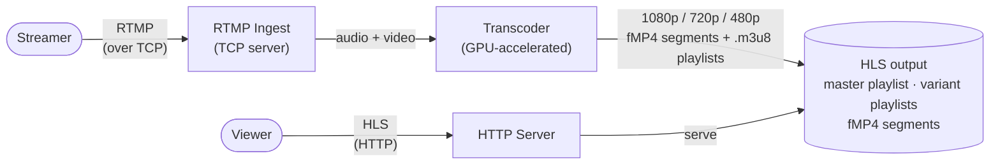
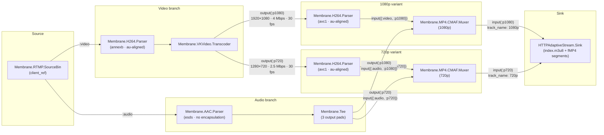

# Bringing Membrane to production

This article is the first in a series on building a fully functional multimedia processing solution with [Membrane Framework](https://membrane.stream).
The complete source code for this chapter is available at [membraneframework-labs/tutorial_vk_video](https://github.com/membraneframework-labs/tutorial_vk_video).

## Introduction
We will build a live video broadcasting system: one that ingests an RTMP stream,
transcodes it into multiple resolutions to accommodate viewers with varying network conditions,
and distributes it globally over HLS.
Systems like this are the backbone of platforms such as Twitch — they allow user-generated content to be broadcast
simultaneously to thousands of viewers around the world, with the lowest possible end-to-end latency.
They are also offered as managed services (e.g. AWS IVS) so that product teams can embed live streaming
without building the infrastructure themselves.

Building a reliable broadcasting system is non-trivial.
We will show, however, that a solid foundation can be written in Elixir with Membrane Framework —
one that runs in production, utilizes GPU resources efficiently, and scales with demand.

Here is the plan:

1. **Build the multimedia processing pipeline** — using existing Membrane components, we will build a pipeline
   that ingests an RTMP stream, transcodes it with GPU hardware acceleration into multiple resolutions and bitrates,
   packages each variant as fragmented MP4 (CMAF), and generates a `.m3u8` multi-variant playlist
   so the player can select the appropriate quality based on network conditions.
2. **Wrap the pipeline in an Elixir application** to take advantage of OTP supervision trees and runtime configuration.
3. **Prepare a release** of the application.
4. **Ensure scalability** with clustering on Kubernetes.
5. **Deploy to the cloud** with GPU-capable runners for hardware-accelerated encoding and decoding.
6. **Configure a CDN** for global distribution.
7. **Add observability.**

In this chapter we cover the first three steps.

## Prerequisites
In this chapter we will create an Elixir application and run it locally.
Since the application will be performing hardware-accelerated video transcoding with the use of Vulkan Video Extensions,
you need a Linux machine with a Vulkan-capable GPU (NVIDIA or AMD) with Mesa drivers and Vulkan Video extension support.

For more information, you can take a look at [vk-video](https://crates.io/crates/vk-video) Rust package which delivers hardware-accelerated transcoding capabilities,
which Membrane element uses under the hood.
In the next chapters we will focus on deploying the application in the cloud environment
so you won’t need to run the application locally, so this requirement won’t apply anymore.

If you are new to Membrane, please take a look at the [Getting Started with Membrane](https://hexdocs.pm/membrane_core/01_introduction-2.html) guide
as it presents basic Membrane concepts and shows how to write your own simple pipelines —
we won’t discuss these things in detail in this tutorial.
For development purposes, make sure you have [FFmpeg](https://ffmpeg.org/) installed.

## System overview

The system consists of three main stages: **ingestion**, **transcoding**, and **distribution**.

**Ingestion** — the streamer publishes a live video feed over RTMP (Real-Time Messaging Protocol).
RTMP is a widely supported streaming protocol, originally developed by Adobe,
that carries audio and video data over a persistent TCP connection.
The server accepts the incoming TCP connection and extracts the raw audio and video streams from the RTMP envelope.

**Transcoding** — the incoming stream is typically encoded at a single resolution and bitrate chosen by the streamer.
To serve viewers with varying network conditions and device capabilities, we transcode it into multiple output variants
(e.g. 1080p, 720p, 480p), each at a different resolution and target bitrate.
This is done using the GPU's hardware video acceleration,
which is far more efficient than software-based encoding for this kind of workload.

**Distribution** — the transcoded variants are packaged and delivered to viewers via HLS (HTTP Live Streaming).
Each variant is split into short media segments —
fragmented MP4 files (fMP4, also known as CMAF — Common Media Application Format) —
and an HTTP server exposes two kinds of playlist files alongside them:
- a **master playlist** (`.m3u8`) listing all available variants with their bandwidth and resolution,
  so the player can pick the most appropriate one;
- a **variant playlist** (`.m3u8`) per resolution, listing the individual segments in order
  so the player can fetch and play them sequentially.



## Creating a new project
Let’s start by creating a new `mix` project with the name of your choice:
```
mix new ex_broadcaster
```
It will create a template of a Mix project with the basic application structure. 

## Dependencies
In `mix.exs` add the required dependencies:
```elixir
# mix.exs
defp deps do 
	[
      {:membrane_core, "~> 1.2"},
      {:membrane_vk_video_plugin, "~> 0.2.1"},
      {:membrane_rtmp_plugin, "~> 0.29.3"},
      {:membrane_http_adaptive_stream_plugin, "~> 0.21.0"},
      {:membrane_mp4_plugin, "~> 0.36.0"},
      {:membrane_h26x_plugin, "~> 0.10.5"},
      {:membrane_aac_plugin, "~> 0.19.0"}
    ]
  end
```
We need the following packages:

- [`membrane_core`](https://hexdocs.pm/membrane_core) — to specify the pipeline structure
- [`membrane_vk_video_plugin`](https://hexdocs.pm/membrane_vk_video_plugin) — providing hardware transcoding capabilities
- [`membrane_rtmp_plugin`](https://hexdocs.pm/membrane_rtmp_plugin) — for RTMP ingestion source
- [`membrane_http_adaptive_stream_plugin`](https://hexdocs.pm/membrane_http_adaptive_stream_plugin) — for HLS playlist generation
- [`membrane_mp4_plugin`](https://hexdocs.pm/membrane_mp4_plugin) — for wrapping stream in CMAF container
- [`membrane_h26x_plugin`](https://hexdocs.pm/membrane_h26x_plugin) and [`membrane_aac_plugin`](https://hexdocs.pm/membrane_aac_plugin) —
  to change the stream structure of video and audio streams (so that they "fit" in CMAF container)

### Configuration
In `config/config.exs` let’s add the following entries which we will use later:
```elixir
# config/config.exs
config :ex_broadcaster,
  rtmp_port: 1935,
  segment_duration_sec: 4,
  http_port: 8080,
  max_concurrent_pipelines: 10,
  storage: :file,
  hls_output_dir: "output/hls"
```
We specify the following entries:

- `rtmp_port` — (TCP) port at which RTMP server will be listening
- `segment_duration_sec` — duration of each fragmented `.mp4` CMAF segment (expressed in seconds)
- `http_port` — port at which the generated HLS playlist will be served via HTTP server
- `max_concurrent_pipelines` — limits the number of pipelines which can be run at once
- `storage` — selects the storage backend; `:file` writes segments to local disk (used here for development)
- `hls_output_dir` — path to the directory where HLS output will be written when `storage: :file` is used

The provided values are reasonable for a local development, but we will need to change them later,
when we deploy the application.


## Application startup
In `lib/ex_broadcaster/application.ex` add the `start/2` function:
```elixir
# lib/ex_broadcaster/application.ex
defmodule ExBroadcaster.Application do
  …
  @max_concurrent_pipelines Application.compile_env(:ex_broadcaster, :max_concurrent_pipelines, 10)

  @impl true
  def start(_type, _args) do
    rtmp_port = Application.get_env(:ex_broadcaster, :rtmp_port, 1935)
    http_port = Application.get_env(:ex_broadcaster, :http_port, 8080)

    children = [
      {Membrane.RTMPServer, port: rtmp_port, handle_new_client: &__MODULE__.handle_new_client/3},
      {DynamicSupervisor, name: __MODULE__.PipelineSupervisor, strategy: :one_for_one},
      {Bandit, plug: Broadcaster.HTTPServer, port: http_port}
    ]

    Logger.info("[App] RTMP server listening on port #{rtmp_port}")
    Logger.info("[App] HTTP server listening on port #{http_port}")

    Supervisor.start_link(children, strategy: :one_for_one, name: __MODULE__)
  end
end
```

On application startup we spawn:

- RTMP server listening on chosen port
- `DynamicSupervisor` under which we will spawn the pipelines handling particular streams.
  Since all its children will be independent from each other, we want it to use `:one_for_one` supervision strategy.
- `Bandit` HTTP server — a minimal [Plug.Router](https://hexdocs.pm/plug/Plug.Router.html)-based server
  ([`http_server.ex`](https://github.com/membraneframework-labs/tutorial_vk_video/blob/main/lib/ex_broadcaster/http_server.ex))
  that serves HLS playlists and fMP4 segments from the configured `hls_output_dir`.
  It sets appropriate cache headers — `no-cache` for `.m3u8` playlists (which change every segment)
  and a long `max-age` for segment files (immutable once written) — and allows CORS from any origin
  so browser-based players like hls.js work without a proxy.
  We include it here for local development only — in production, a CDN will take over content delivery.

We use `:one_for_one` supervision strategy to ensure that each child is restarted independently from the other.

### RTMP Server
RTMP Server requires providing `handle_new_client` callback.
It’s called each time a new client connects to the server. Let’s implement it:

```elixir
# lib/ex_broadcaster/application.ex
  def handle_new_client(client_ref, app, stream_key) do
    Logger.info("[App] New RTMP client: app=#{app}, stream_key=#{stream_key}")

    segment_duration_sec = Application.get_env(:ex_broadcaster, :segment_duration_sec, 4)

    pipeline_opts = [
      client_ref: client_ref,
      storage: build_storage(stream_key),
      segment_duration: Membrane.Time.seconds(segment_duration_sec)
    ]

    %{active: active} = DynamicSupervisor.count_children(__MODULE__.PipelineSupervisor)

    if active >= @max_concurrent_pipelines do
      Logger.warning("[App] Rejecting client (stream_key=#{stream_key}): reached limit of #{@max_concurrent_pipelines} concurrent pipelines")
    else
      case DynamicSupervisor.start_child(
             __MODULE__.PipelineSupervisor,
             Supervisor.child_spec({ExBroadcaster.Pipeline, pipeline_opts}, restart: :temporary)
           ) do
        {:ok, _supervisor, pid} ->
          Logger.info("[App] Pipeline started (pid=#{inspect(pid)}) for stream_key=#{stream_key}")

        {:error, reason} ->
          Logger.error("[App] Failed to start pipeline: #{inspect(reason)}")
      end
    end

    Membrane.RTMP.Source.ClientHandlerImpl
  end

  defp build_storage(stream_key) do
    base_dir = Application.get_env(:ex_broadcaster, :hls_output_dir, "output/hls")
    output_dir = Path.join(base_dir, stream_key)
    File.mkdir_p!(output_dir)
    %Membrane.HTTPAdaptiveStream.Storages.FileStorage{directory: output_dir}
  end
```

In this callback we assert that no more than `max_concurrent_pipelines` would be running at once
after spawning a new pipeline — if not, we attempt to spawn the new pipeline
under the `DynamicSupervisor` spawned in the application.
We provide the desired options to the pipeline (we will talk about these options later)
and check if the pipeline startup was successful.

`build_storage/1` constructs the storage backend for the pipeline.
It reads `hls_output_dir` from config, appends the stream key so that concurrent streams
do not overwrite each other's files,
ensures the directory exists, and returns a `FileStorage` struct.
Keeping this logic separate from `handle_new_client` makes it straightforward to swap in a different backend later
without touching the rest of the callback.

We use `Supervisor.child_spec/2` to set `restart: :temporary` on the pipeline.
Each pipeline is bound to a specific RTMP connection — if it crashes,
the TCP connection is gone and the `client_ref` is stale,
so restarting it would be pointless. With `restart: :temporary` the supervisor simply removes the pipeline when it exits
without attempting to restart it.

The last thing we do is to return a module implementing the RTMP client behaviour.
In many circumstances we would need to implement this behaviour on our own,
but since we want to use the Membrane.RTMP.Server
with `Membrane.RTMP.Source`, we return `Membrane.RTMP.Source.ClientHandlerImpl` which is a preexisting implementation
meant to be used with this common case.

## Building the pipeline
Now let’s add a new pipeline module, e.g. `ExBroadcaster.Pipeline` and a simple `start_link/1` implementation
that will start the Pipeline module with passed options.
See the [`Membrane.Pipeline` docs](https://hexdocs.pm/membrane_core/Membrane.Pipeline.html)
for the full list of available callbacks.
```elixir
# lib/ex_broadcaster/pipeline.ex
defmodule ExBroadcaster.Pipeline do
  use Membrane.Pipeline

  require Membrane.Logger, as: Logger

  @variants [
    %{id: :p1080, track_name: "1080p", width: 1920, height: 1080, bitrate: 4_000_000, framerate: {30, 1}},
    %{id: :p720,  track_name: "720p",  width: 1280, height: 720,  bitrate: 2_500_000, framerate: {30, 1}},
    %{id: :p480,  track_name: "480p",  width: 854,  height: 480,  bitrate: 1_000_000, framerate: {30, 1}}
  ]

  def start_link(opts) do
    Membrane.Pipeline.start_link(__MODULE__, opts)
  end
end
```
We can start implementing Membrane pipeline callbacks.

### `handle_init` callback

Let’s start with `handle_init`:
```elixir
# lib/ex_broadcaster/pipeline.ex
  @impl true
  def handle_init(_ctx, opts) do
    client_ref = Keyword.fetch!(opts, :client_ref)
    storage = Keyword.fetch!(opts, :storage)
    segment_duration = Keyword.get(opts, :segment_duration, Membrane.Time.seconds(4))

    spec = build_spec(client_ref, storage, segment_duration)

    {[spec: spec], %{}}
  end
```

This callback reads the desired options:
- `client_ref` — RTMP client reference. Each time a new client connects to the RTMP server
  you will obtain this reference and you will be able to pass it to the `Membrane.RTMP.SourceBin` component.
- `storage` — an already-constructed storage struct (built by `build_storage/1` in the application).
  The pipeline passes it straight to the HLS sink and has no knowledge of where data ends up.
- `segment_duration` — duration of each HLS segment.
  The shorter it is, the smaller streamer → viewer latency you should observe
  (you cannot reduce it indefinitely as each segment must contain at least one keyframe,
  and generating keyframes too frequently increases bitrate and encoder load).
  A value of 2–6 seconds is typical for live streaming.

Then we return the pipeline structure within the `spec` action.
Let’s discuss the pipeline structure (and `build_spec` private function implementation).

### Pipeline structure:

Each `ExBroadcaster.Pipeline` is a static Membrane pipeline built entirely in `handle_init/2`.
The topology has two branches coming out of the RTMP source — one for video, one for audio —
that converge into per-variant CMAF muxers before reaching the shared HLS sink.



A few things worth noting:

- **Two H264 parsers per video path** — the first one (`H264in`) converts the incoming stream to Annex B byte-stream format
  required by the transcoder; the second ones (`H264out*`) convert each transcoder output back
  to the `avc1` packetized format required by the CMAF container.
  They are completely separate element instances with different configurations.
- **`Membrane.Tee` for audio fan-out** — audio is decoded only once and replicated to all three CMAF muxers
  via dynamic output pads. There is no audio re-encoding.
- **One `CMAF.Muxer` per variant** — each muxer receives exactly one video pad and one audio pad,
  producing a single interleaved fMP4 track that HLS expects.
- **Dynamic pads on `Transcoder` and `Tee`** — output pads are opened at link time with `via_out(Pad.ref(:output, id), ...)`,
  passing encoding parameters (resolution, bitrate, scaling algorithm) as pad options to the transcoder.


#### `build_spec/3`
```elixir
# lib/ex_broadcaster/pipeline.ex
  defp build_spec(client_ref, storage, segment_duration) do
    rtmp_source =
      child(:rtmp_source, %Membrane.RTMP.SourceBin{client_ref: client_ref})

    video_branch =
      get_child(:rtmp_source)
      |> via_out(:video)
      |> child(:h264_parser, %Membrane.H264.Parser{
        output_alignment: :au,
        output_stream_structure: :annexb
      })
      |> child(:transcoder, Membrane.VKVideo.Transcoder)

    audio_branch =
      get_child(:rtmp_source)
      |> via_out(:audio)
      |> child(:aac_parser, %Membrane.AAC.Parser{out_encapsulation: :none, output_config: :esds})
      |> child(:audio_tee, Membrane.Tee)

    hls_sink =
      child(:hls_sink, %HTTPAdaptiveStream.Sink{
        manifest_config: %HTTPAdaptiveStream.Sink.ManifestConfig{
          name: "index",
          module: HTTPAdaptiveStream.HLS
        },
        track_config: %HTTPAdaptiveStream.Sink.TrackConfig{},
        storage: storage
      })

    variant_specs = Enum.flat_map(@variants, &build_variant_spec(&1, segment_duration))

    [rtmp_source, video_branch, audio_branch, hls_sink | variant_specs]
  end
```

`build_spec` constructs the pipeline topology as a list of linked element chains which Membrane will wire together:

- **`rtmp_source`** — `Membrane.RTMP.SourceBin` receives the incoming RTMP connection identified by `client_ref`
  and demuxes it, exposing separate `:video` and `:audio` output pads.
- **`video_branch`** — takes the raw H.264 video, runs it through `Membrane.H264.Parser` (reformatting to Annex B, AU-aligned)
  to produce a stream the transcoder can consume,
  then hands it off to `Membrane.VKVideo.Transcoder` for GPU-accelerated re-encoding.
- **`audio_branch`** — takes the AAC audio stream, parses it into raw ADTS-stripped frames with ESDS config,
  then feeds it into a `Membrane.Tee` so the single audio stream can be fanned out
  to all resolution variants without re-encoding.
- **`hls_sink`** — `HTTPAdaptiveStream.Sink` collects CMAF tracks from all variants and writes fMP4 segments
  plus a multi-variant `index.m3u8` playlist via the provided `storage` backend.

Apart from there there we define `variant_specs` — one spec per entry in `@variants`,
built by `build_variant_spec/2` (covered in the next section).
Each variant connects a transcoder output pad and a tee output pad into a shared CMAF muxer,
which feeds its track into the HLS sink.

#### `build_variant_spec/2`

`build_variant_spec/2` is called once per entry in `@variants` and returns two linked element chains —
one for video, one for audio — that together form a single resolution variant:

```elixir
# lib/ex_broadcaster/pipeline.ex
  defp build_variant_spec(variant, segment_duration) do
    %{id: id, track_name: name, width: w, height: h, bitrate: br, framerate: fps} = variant

    video_to_muxer =
      get_child(:transcoder)
      |> via_out(Pad.ref(:output, id),
        options: [
          width: w,
          height: h,
          tune: :low_latency,
          rate_control:
            {:constant_bitrate,
             %VKVideo.Encoder.ConstantBitrate{
               bitrate: br
             }},
          scaling_algorithm: :bilinear
        ]
      )
      |> child({:h264_parser_out, id}, %Membrane.H264.Parser{
        output_alignment: :au,
        output_stream_structure: :avc1
      })
      |> via_in(Pad.ref(:input, {:video, id}))
      |> child({:cmaf_muxer, id}, %CMAFMuxer{segment_min_duration: segment_duration})
      |> via_in(Pad.ref(:input, id),
        options: [
          track_name: name,
          segment_duration: segment_duration,
          max_framerate: fps
        ]
      )
      |> get_child(:hls_sink)

    audio_to_muxer =
      get_child(:audio_tee)
      |> via_out(Pad.ref(:output, id))
      |> via_in(Pad.ref(:input, {:audio, id}))
      |> get_child({:cmaf_muxer, id})

    [video_to_muxer, audio_to_muxer]
  end
```

The **video chain** (`video_to_muxer`) starts from the transcoder.
Each output pad is opened with `via_out(Pad.ref(:output, id), options: [...])`,
passing the encoding parameters for this variant:
target resolution, constant bitrate, low-latency tuning, and bilinear scaling.
The re-encoded H.264 stream is then parsed a second time —
this time reformatted to `avc1` stream structure required by the CMAF container —
before being muxed into `{:cmaf_muxer, id}`. The muxer output is then linked into the shared `:hls_sink`,
with per-track metadata such as `track_name` and `max_framerate` passed via `via_in` options.

The **audio chain** (`audio_to_muxer`) is simpler: it taps the `:audio_tee` at a dynamic output pad keyed by `id`
and feeds directly into the same `{:cmaf_muxer, id}` that the video chain already created.
This means a single CMAF muxer produces one interleaved audio+video track per variant,
which is exactly what HLS adaptive streaming expects.

### Self-termination of the pipeline:

We need to add `handle_element_end_of_stream` callback to ensure proper termination of the pipeline
when the stream ends:
```elixir
# lib/ex_broadcaster/pipeline.ex
  @impl true
  def handle_element_end_of_stream(:hls_sink, _pad, _ctx, state) do
    Logger.info("HLS sink finished. Terminating pipeline.")
    {[terminate: :normal], state}
  end

  def handle_element_end_of_stream(_child, _pad, _ctx, state) do
    {[], state}
  end
```
We only need to `terminate: normal` when the end-of-stream signal arrives at `:hls_sink` sink element.

## Running the application
Now our pipeline is ready for running.
In development environment we can do:

```sh
mix run --no-halt
```

Then we can start a test stream with FFmpeg:
```sh
ffmpeg -re -f lavfi -i testsrc=size=1280x720:rate=30 -f lavfi -i sine=frequency=1000 -c:v libx264 -preset veryfast -tune zerolatency -pix_fmt yuv420p -c:a aac -f flv rtmp://localhost:1935/broadcaster/key
```

The HLS output will be written to `output/hls/key/` and served by the built-in HTTP server at:
```
http://localhost:8080/key/index.m3u8
```
You can open this URL directly in a browser with native HLS support (e.g. Safari or Chrome).
Alternatively, paste it into the [hls.js demo player](https://hlsjs.video-dev.org/demo/).

## Adding S3 storage

The file-based storage works well for local development, but for production we want to upload segments directly to S3
so they can be served by a CDN.
Because the pipeline accepts a plain storage struct and knows nothing about where data lands,
adding a second backend requires no changes to the pipeline at all.

### Dependencies

Add `ex_aws`, `ex_aws_s3`, and `hackney` (the HTTP client ExAws uses) to `mix.exs`:

```elixir
# mix.exs
{:ex_aws, "~> 2.6"},
{:ex_aws_s3, "~> 2.5"},
{:hackney, "~> 1.9"}
```

### Implementing the storage

Create `lib/ex_broadcaster/storages/s3_storage.ex` and implement the
[`Membrane.HTTPAdaptiveStream.Storage`](https://hexdocs.pm/membrane_http_adaptive_stream_plugin/Membrane.HTTPAdaptiveStream.Storage.html) behaviour.
The behaviour requires two callbacks: `store/6` for writing a file and `remove/4` for deleting one.
Each file is stored at `<prefix>/<name>` inside the bucket,
where the prefix is set per-stream so concurrent streams do not collide.

```elixir
# lib/ex_broadcaster/storages/s3_storage.ex
defmodule ExBroadcaster.Storages.S3Storage do
  @behaviour Membrane.HTTPAdaptiveStream.Storage

  require Logger

  @enforce_keys [:bucket, :prefix]
  defstruct @enforce_keys

  @impl true
  def init(%__MODULE__{} = config), do: config

  @impl true
  def store(_parent_id, name, content, _metadata, _ctx, %{bucket: bucket, prefix: prefix} = state) do
    key = prefix <> "/" <> name

    case bucket |> ExAws.S3.put_object(key, content) |> ExAws.request() do
      {:ok, _} -> {:ok, state}
      {:error, reason} ->
        Logger.error("S3 upload failed for #{key}: #{inspect(reason)}")
        {{:error, reason}, state}
    end
  end

  @impl true
  def remove(_parent_id, name, _ctx, %{bucket: bucket, prefix: prefix} = state) do
    key = prefix <> "/" <> name

    case bucket |> ExAws.S3.delete_object(key) |> ExAws.request() do
      {:ok, _} -> {:ok, state}
      {:error, reason} ->
        Logger.warning("S3 delete failed for #{key}: #{inspect(reason)}")
        {{:error, reason}, state}
    end
  end
end
```

`init/1` is called once by the HLS sink before streaming starts and simply returns the config struct as state.
`store/6` and `remove/4` are then called for every segment and manifest file as the stream progresses.

AWS credentials and region are resolved by ExAws from the environment in the usual way
— `AWS_ACCESS_KEY_ID`, `AWS_SECRET_ACCESS_KEY`, `AWS_REGION` environment variables,
an instance role, or entries in `config/runtime.exs`.

### Selecting the backend

Update `config/config.exs` to add the S3-specific keys alongside the existing ones:

```elixir
# config/config.exs
config :ex_broadcaster,
  ...
  storage: :file,        # change to :s3 for production
  hls_output_dir: "output/hls",
  s3_bucket: "your-bucket-name",
  s3_prefix: "hls"
```

Now let's update `build_storage/1` function in `Application` to handle both values of `storage:` —
it needs to construct either a `%FileStorage{}` or a `%S3Storage{}`:

```elixir
# lib/ex_broadcaster/application.ex
defp build_storage(stream_key) do
  case Application.get_env(:ex_broadcaster, :storage, :file) do
    :s3 ->
      bucket = Application.fetch_env!(:ex_broadcaster, :s3_bucket)
      prefix = Application.get_env(:ex_broadcaster, :s3_prefix, "hls")
      %S3Storage{bucket: bucket, prefix: prefix <> "/" <> stream_key}

    :file ->
      base_dir = Application.get_env(:ex_broadcaster, :hls_output_dir, "output/hls")
      output_dir = Path.join(base_dir, stream_key)
      File.mkdir_p!(output_dir)
      %FileStorage{directory: output_dir}
  end
end
```

Switching to S3 in production is then a single config change —
or, more practically, driven by an environment variable in `config/runtime.exs`:

```elixir
# config/runtime.exs
import Config

config :ex_broadcaster,
  storage: if(System.get_env("S3_BUCKET"), do: :s3, else: :file),
  s3_bucket: System.get_env("S3_BUCKET", ""),
  s3_prefix: System.get_env("S3_PREFIX", "hls")
```

## Building a release

For deployment outside the development environment, we can now build a self-contained release with:
```sh
MIX_ENV=prod mix release
```

This compiles the application and bundles it together with the Erlang runtime into `_build/prod/rel/ex_broadcaster/`.
The release can then be started on any compatible machine without Elixir or Mix installed:
```sh
_build/prod/rel/ex_broadcaster/bin/ex_broadcaster start
```

Before doing so, remember to set appropriate environmental variables:
`AWS_ACCESS_KEY_ID`, `AWS_SECRET_ACCESS_KEY`, `AWS_REGION`, `S3_BUCKET` and `S3_PREFIX`
to make sure that the output playlist is stored in S3 bucket.

