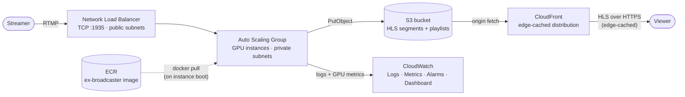

# Live Video Broadcasting: Deploying to AWS

This is the second article in a series on building a fully functional multimedia processing solution with [Membrane Framework](https://github.com/membraneframework).
The [first chapter](./1_building_multimedia_application_in_elixir.md) built the RTMP → transcode → HLS pipeline, wrapped it in an OTP application,
added an S3 storage backend, and packaged it as a release. This chapter takes that release to production on AWS.
The complete Terraform configuration referenced below lives in the `terraform/` directory of the same repository,
[membraneframework-labs/ex_broadcaster](https://github.com/membraneframework-labs/ex_broadcaster).

## What we'll build

By the end of this chapter, you will have:

- a Docker image of the release, built for `linux/amd64` and pushed to a private **ECR** repository;
- a fleet of GPU-capable EC2 instances running that image, managed by an **Auto Scaling Group** and reachable through a **Network Load Balancer** for RTMP ingest;
- the **S3 bucket** from chapter 1, now provisioned by Terraform alongside everything else;
- a **CloudFront distribution** in front of that bucket, so HLS output is served from edge locations instead of a single region;
- **CloudWatch** logs, GPU/host metrics, alarms, and a dashboard so you can actually tell whether the thing is healthy.

## Prerequisites

You will need:

- an AWS account, and the [AWS CLI v2](https://docs.aws.amazon.com/cli/latest/userguide/getting-started-install.html) installed and configured with a named profile
  that has permission to create VPCs, EC2/ASG/ELB resources, IAM roles, an ECR repository, an S3 bucket, and CloudWatch resources
  (for a personal tutorial account, attaching `AdministratorAccess` to your profile is the path of least resistance;
  in a shared account, scope it down to the equivalent service-level policies);
- [Terraform](https://developer.hashicorp.com/terraform/install) >= 1.5;
- [Docker](https://docs.docker.com/get-docker/) with `buildx` (bundled with recent Docker Desktop/Engine installs) —
  we need it to cross-compile the image for `linux/amd64` regardless of your local machine's architecture;
- the chapter 1 code, with the S3 storage backend wired in as described in [Adding S3 storage](./1_building_multimedia_application_in_elixir.md#adding-s3-storage).

One more permission is worth calling out separately: pushing images to ECR from your own machine requires your
*local* AWS profile to have `AmazonEC2ContainerRegistryPowerUser` (or broader). This is distinct from the
*instance role* the EC2 fleet runs under, which only needs read/pull access — that one is defined in Terraform
and covered below.

## Infrastructure overview



The Terraform configuration is split into one file per concern:

| File | Provisions |
| --- | --- |
| `providers.tf` | The `aws` provider, pinned to `var.aws_region` |
| `vpc.tf` | A VPC with public and private subnets across two AZs (chosen dynamically for the configured region), plus a NAT gateway |
| `security_groups.tf` | The security group attached to the instances (RTMP in, everything out) |
| `ecr.tf` | The ECR repository the image is pushed to, with a lifecycle policy |
| `iam.tf` | The instance role/profile: scoped S3 access, ECR pull, SSM, CloudWatch Agent |
| `s3.tf` | The HLS bucket, its public-read policy, and CORS configuration |
| `cloudfront.tf` | The CloudFront distribution fronting the HLS bucket for edge caching |
| `asg.tf` | The GPU launch template, Auto Scaling Group, and CPU-based scaling policy |
| `nlb.tf` | The Network Load Balancer and TCP target group for RTMP |
| `cloudwatch.tf` | Log groups, alarms, an SNS topic, and the monitoring dashboard |
| `user_data.sh.tpl` | The instance bootstrap script (installs Docker/NVIDIA/CloudWatch Agent, runs the container) |
| `variables.tf` | Everything above, parameterized |

We'll go through them roughly in the order you'd apply them, since a couple of things (the GPU quota, the ECR repository)
need to exist before the rest can come up cleanly.

## Requesting a GPU instance quota increase

New AWS accounts start with a **default quota of 0** for "Running On-Demand G and VT instances" in most regions —
this is the vCPU quota family that covers `g6.xlarge` (the instance type we use for Vulkan Video hardware-accelerated
transcoding). If you skip this step, the Auto Scaling Group will sit there failing to launch instances with an
opaque `VcpuLimitExceeded` error, so request the increase *before* you run `terraform apply`.

You can find the exact quota in the console under **Service Quotas → AWS services → Amazon EC2 → "Running On-Demand G and VT instances"**,
or request it directly from the CLI:

```sh
aws service-quotas request-service-quota-increase \
  --region <your-aws-region> --service-code ec2 --quota-code L-DB2E81BA \
  --desired-value 16
```

Request it in the same region you set as `aws_region` in `variables.tf` (see below) — quotas are per-region, so requesting an increase in the wrong one leaves the region you actually deploy to still at 0.

Size `--desired-value` for the vCPU count you actually need: a `g6.xlarge` has 4 vCPUs, so a value of 16 leaves
headroom for `asg_max_size = 3` instances plus a rolling instance refresh replacing one at a time. Adjust it (and
`instance_type`/`asg_max_size` in `variables.tf`) to match the instance family and fleet size you plan to run.

Check on the request's status with:

```sh
aws service-quotas get-requested-service-quota-change \
  --region <your-aws-region> --request-id <request-id-from-the-previous-command>
```

Approval is often instant but can take up to a day or two for larger increases — request it first, then move on to
the rest of the setup while you wait.

You don't have to sit around waiting for it, though: set `gpu_enabled = false` (in `variables.tf` or via
`terraform apply -var="gpu_enabled=false"`) and the ASG falls back to a `c6i.large` (no GPU, no Vulkan Video quota needed) instead
of `g6.xlarge`, so you can bring up the rest of the stack and exercise it end-to-end immediately. `Membrane.Transcoder`
falls back to software encoding on that fleet, since Vulkan Video hardware acceleration isn't available there — switch
back to `gpu_enabled = true` (the default) once your quota is approved to get hardware-accelerated transcoding in production.

## Initializing Terraform

From the `terraform/` directory:

```sh
terraform init
```

This is a good moment to look at `variables.tf`, since every default in it is a deliberate choice you may want to override:

```hcl
# terraform/variables.tf
variable "aws_region"           { default = "eu-north-1" }  # override for any region — everything below follows
variable "instance_type"        { default = "g6.xlarge" }  # NVIDIA L4, matches Vulkan Video's HW acceleration needs
variable "asg_min_size"         { default = 1 }
variable "asg_max_size"         { default = 3 }
variable "asg_desired_capacity" { default = 1 }
variable "cpu_target_value"     { default = 60 }            # target-tracking scaling threshold
variable "root_volume_size_gb"  { default = 20 }
variable "app_image_tag"        { default = "latest" }
variable "s3_prefix"            { default = "hls" }
variable "log_retention_days"   { default = 14 }
variable "alarm_email"          { default = "" }            # set to get alarm emails via SNS
```

`aws_region` is the single source of truth for where everything gets deployed — `providers.tf` passes it straight
into the `aws` provider block (`provider "aws" { region = var.aws_region }`), and `vpc.tf` picks its two
availability zones dynamically via the `aws_availability_zones` data source rather than hardcoding AZ names tied
to one region. To deploy elsewhere, override it (e.g. `terraform apply -var="aws_region=us-east-1"`, or set it in
a `variables.tf` file) — just make sure `g6.xlarge` (or whichever `instance_type` you choose) is actually
offered there, and that you request the GPU quota increase above in that same region.

## Building and pushing the image

Chapter 1's `Dockerfile` builds the release in an `hexpm/elixir` builder stage and copies it into an
`nvcr.io/nvidia/cuda` runtime stage so the container has the CUDA/Vulkan userspace libraries the transcoder needs
at runtime; the NVIDIA driver itself is installed on the *host* (we'll get to that in `user_data.sh.tpl`) and
exposed into the container via `--gpus all`.

Authenticate Docker against your new ECR repository:

```sh
aws ecr get-login-password --region <your-aws-region> \
  | docker login --username AWS --password-stdin <account-id>.dkr.ecr.<your-aws-region>.amazonaws.com
```

(`<account-id>` is your AWS account ID — `aws sts get-caller-identity` prints it — and `<your-aws-region>` is
whatever you set `aws_region` to in `variables.tf`. Simplest option: just copy both straight out of the
`ecr_repository_url` Terraform output from the previous step, which already has the full URL.)

Then build and push, explicitly targeting `linux/amd64` — the EC2 fleet runs on x86_64, and if you're building
from an Apple Silicon Mac (or any non-amd64 machine) a plain `docker build` would otherwise produce an image the
instances can't run:

```sh
docker buildx build \
  --platform linux/amd64 \
  -t <account-id>.dkr.ecr.<your-aws-region>.amazonaws.com/ex-broadcaster:latest \
  --push .
```

`--push` uploads the image directly from the build without a separate `docker push` step. Expect this build to
take a while the first time — it's compiling Membrane's native dependencies (FFmpeg, Vulkan headers) from source
inside the builder stage.

## Provisioning the rest of the infrastructure

With the image in ECR, bring up everything else:

```sh
terraform apply
```

A few of these resources are worth understanding before you run it.

### The S3 bucket

`s3.tf` provisions the same bucket chapter 1's `S3Storage` writes to, now as part of the infrastructure instead of
something you created by hand.

```hcl
# terraform/s3.tf
resource "aws_s3_bucket" "hls" {
  bucket = "ex-broadcaster-hls-${data.aws_caller_identity.current.account_id}"
}
```

It's configured with a public-read bucket policy (scoped to `s3:GetObject` only — nobody can list or write
without the instance role's credentials) and a permissive CORS rule for `GET`/`HEAD`, mirroring the CORS behavior
of the development HTTP server from chapter 1 so `hls.js`-based players work against the bucket directly.
The public-read policy is convenient for this tutorial, but isn't how you'd want to expose storage
in production — there, scope access to CloudFront only (e.g. via Origin Access Control) instead of making the
bucket world-readable.

### The GPU launch template and Auto Scaling Group

`asg.tf` is the centerpiece — it defines what an instance looks like and how many of them should run:

```hcl
# terraform/asg.tf
resource "aws_launch_template" "ex_broadcaster" {
  image_id      = data.aws_ssm_parameter.ubuntu_ami.value  # plain Ubuntu 22.04, no NVIDIA driver preinstalled
  instance_type = var.instance_type                        # g6.xlarge
  iam_instance_profile { name = aws_iam_instance_profile.ex_broadcaster.name }
  vpc_security_group_ids = [aws_security_group.instance.id]

  user_data = base64encode(templatefile("${path.module}/user_data.sh.tpl", { ... }))
}

resource "aws_autoscaling_group" "ex_broadcaster" {
  vpc_zone_identifier = module.vpc.private_subnets
  min_size            = var.asg_min_size
  max_size            = var.asg_max_size
  desired_capacity    = var.asg_desired_capacity
  health_check_type   = "ELB"
  target_group_arns   = [aws_lb_target_group.rtmp.arn]

  instance_refresh {
    strategy    = "Rolling"
    preferences = { min_healthy_percentage = 50, instance_warmup = 300 }
  }
}

resource "aws_autoscaling_policy" "cpu_target_tracking" {
  policy_type = "TargetTrackingScaling"
  target_tracking_configuration {
    predefined_metric_specification { predefined_metric_type = "ASGAverageCPUUtilization" }
    target_value = var.cpu_target_value
  }
}
```

Two things worth flagging, both left as known limitations rather than hidden:

- **Scaling is CPU-based, but the workload is GPU-bound.** Vulkan Video hardware transcoding barely touches the
  CPU, so `ASGAverageCPUUtilization` is a weak proxy for actual capacity. The `gpu_utilization_high` alarm
  (see [Monitoring](#monitoring) below) exists specifically to catch the case where GPU utilization is pegged
  while CPU-based scaling sees no reason to add capacity — treat it as a signal to raise `cpu_target_value`,
  lower it, or move to a custom GPU-utilization-driven scaling policy once you have real traffic patterns to tune against.
- **Scale-in has no graceful drain.** RTMP connections are long-lived; an instance refresh or scale-in event
  terminates whatever streams happen to be running on that instance with no warning. A production setup would add
  an `aws_autoscaling_lifecycle_hook` that waits for zero active pipelines (the application already tracks this
  via `DynamicSupervisor.count_children/1`) before allowing termination.

## Instance bootstrap

`user_data.sh.tpl` runs once on first boot and does everything needed to turn a bare Ubuntu AMI into a running
broadcaster node:

1. installs and starts Docker;
2. installs the NVIDIA driver and the NVIDIA Container Toolkit (so `docker run --gpus all` works), skipping this
   if they're already present in a custom AMI;
3. installs and configures the CloudWatch Agent from the templated JSON config (host/GPU metrics + log tailing —
   more on this below);
4. installs the AWS CLI, authenticates Docker against ECR, and pulls the image;
5. runs the container:

```sh
# terraform/user_data.sh.tpl
docker run -d \
  --name ex-broadcaster \
  --restart unless-stopped \
  --gpus all \
  --log-driver=awslogs \
  --log-opt awslogs-region="$AWS_REGION" \
  --log-opt awslogs-group="$APP_LOG_GROUP" \
  --log-opt awslogs-stream="$INSTANCE_ID" \
  --log-opt awslogs-create-group=false \
  -p 1935:1935 \
  -p 127.0.0.1:8080:8080 \
  -e AWS_REGION="$AWS_REGION" \
  -e S3_BUCKET="$S3_BUCKET" \
  -e S3_PREFIX="$S3_PREFIX" \
  "$IMAGE"
```

A couple of details worth calling out:

- The container's stdout/stderr go straight to CloudWatch Logs via Docker's own `awslogs` log driver — no sidecar needed.
- Port 8080, the development HTTP server from chapter 1, is only bound to `127.0.0.1`, not exposed to the NLB or the
  internet. In production, HLS is served from S3 (directly, or through a CDN in front of it), so the in-process
  HTTP server has no reason to be reachable from outside the instance.

## Verifying the deployment

Once `terraform apply` finishes, grab the outputs:

```sh
terraform output rtmp_ingest_endpoint       # rtmp://<nlb-dns-name>:1935
terraform output hls_bucket_url             # https://<bucket>.s3.<region>.amazonaws.com
terraform output cloudwatch_dashboard_url
```

Point a test stream at the NLB, same as in chapter 1 but now against the load balancer instead of `localhost`:

```sh
ffmpeg -re -f lavfi -i testsrc=size=1280x720:rate=30 -f lavfi -i sine=frequency=1000 \
  -c:v libx264 -preset veryfast -tune zerolatency -pix_fmt yuv420p -c:a aac \
  -f flv rtmp://<nlb-dns-name>:1935/ex_broadcaster/key
```

The stream should show up shortly after in the bucket, under the date-partitioned prefix from chapter 1's
`build_storage/1`:

```
<hls_bucket_url>/hls/<year>/<month>/<day>/<hour>/key/index.m3u8
```

If nothing shows up, the CloudWatch log groups set up next are the fastest way to find out why.

## Streaming with OBS and watching the output

`ffmpeg` is fine for a synthetic smoke test, but a real check of the end-to-end path means pushing a stream from an
actual encoder and watching it back the way a viewer would.

### Starting a stream with OBS

1. Install [OBS Studio](https://obsproject.com/) if you don't already have it.
2. Open **Settings → Stream**, set **Service** to `Custom...`, and fill in:
   - **Server**: `rtmp://<nlb-dns-name>:1935/ex_broadcaster` (the `rtmp_ingest_endpoint` output, minus the trailing
     `/key` — that part becomes the stream key below);
   - **Stream Key**: any string you like, e.g. `obs-test`. It becomes the `<stream_key>` segment in the S3/CloudFront
     path, so pick something you'll recognize when checking the bucket.
3. Under **Settings → Output**, set the encoder to `x264` (or your GPU encoder of choice) and a bitrate around
   2500–4000 Kbps for a 720p/1080p test — the transcoder on the EC2 side re-encodes the output anyway, so the
   incoming bitrate mostly affects upload bandwidth, not final quality.
4. Add a source (a window capture or a video file works well for a repeatable test) and click **Start Streaming**.

OBS's connection indicator (bottom-right) turning green, with a steady bitrate and no dropped-frames warning,
means the NLB accepted the connection and RTMP ingest is flowing into the ASG.

### Watching the stream

Once OBS is live, give the pipeline a few seconds to produce the first HLS segments, then grab the playlist URL —
the [hls.js demo player](https://hlsjs.video-dev.org/demo/) is the simplest way to check playback end to end:

```
<hls_bucket_url>/hls/<year>/<month>/<day>/<hour>/obs-test/index.m3u8
```

or, if you've set up the CDN from [Setting up a CDN](#setting-up-a-cdn):

```
https://<cdn_domain_name>/<s3_prefix>/<year>/<month>/<day>/<hour>/obs-test/index.m3u8
```

(`<year>/<month>/<day>/<hour>` are UTC and match when you started streaming — the same date-partitioned prefix
from chapter 1's `build_storage/1`; `obs-test` is whatever stream key you set above.)

Paste the URL into the demo player's "stream URL" field and hit **Load**. Playback should start within a few
seconds, matching what's live in OBS with the usual HLS latency (typically several seconds, from segment duration
plus playlist propagation).

If it doesn't load, double-check the prefix/date first — it's the most common mismatch — then fall back to the
CloudWatch log groups below to see whether the container is actually receiving and writing segments.

## Monitoring

`cloudwatch.tf` sets up logs, metrics, alarms, and a dashboard so you don't have to SSM into an instance to know
whether the system is healthy.

### Logs

Two log groups are created, both with `log_retention_days` (default 14 days) retention:

```hcl
# terraform/cloudwatch.tf
resource "aws_cloudwatch_log_group" "app"    { name = "/ex-broadcaster/app" }
resource "aws_cloudwatch_log_group" "system" { name = "/ex-broadcaster/system" }
```

`/ex-broadcaster/app` receives the application's own stdout/stderr (Elixir/Membrane logs) via Docker's `awslogs`
driver, one stream per instance ID. `/ex-broadcaster/system` receives the CloudWatch Agent's tail of
`/var/log/ex-broadcaster-user-data.log` (so a failed bootstrap is visible without a shell) and `/var/log/syslog`,
per `amazon-cloudwatch-agent.json.tpl`'s `logs.logs_collected.files` section.

### Metrics

The same CloudWatch Agent config also collects host and, importantly, **GPU** metrics under a custom
`ExBroadcaster` namespace, dimensioned by instance ID and ASG name:

```json
// terraform/amazon-cloudwatch-agent.json.tpl
"metrics_collected": {
  "mem":  { "measurement": ["mem_used_percent"] },
  "disk": { "measurement": ["used_percent"], "resources": ["/"] },
  "nvidia_gpu": {
    "measurement": [
      "utilization_gpu", "utilization_memory", "memory_used", "memory_total",
      "temperature_gpu", "power_draw",
      "encoder_stats_session_count", "encoder_stats_average_fps", "encoder_stats_average_latency"
    ]
  }
}
```

The `encoder_stats_*` metrics come straight from `nvidia-smi`'s NVENC session accounting, and are the closest
thing to a direct measurement of "how much transcoding work is this box actually doing" — far more meaningful
here than CPU, for the reasons covered above.

### Dashboard

`aws_cloudwatch_dashboard.ex_broadcaster` lays out four widgets — GPU utilization, NVENC encoder
sessions/fps, ASG CPU utilization, and NLB healthy/unhealthy target counts — on one screen. The
`cloudwatch_dashboard_url` output links straight to it in the console; it's the first thing worth checking after
starting a test stream, and the first thing worth checking if a viewer reports a problem.

## Setting up a CDN

Right now viewers fetch HLS segments straight from the S3 bucket — that works, but every request round-trips to a
single region, which is a rough deal for a viewer on the other side of the world. `cloudfront.tf` puts a CloudFront
distribution in front of the same bucket so segments and playlists get cached at edge locations close to viewers
instead.

```hcl
# terraform/cloudfront.tf
resource "aws_cloudfront_distribution" "hls" {
  count = var.enable_cdn ? 1 : 0

  origin {
    domain_name = aws_s3_bucket.hls.bucket_regional_domain_name
    origin_id   = "hls-s3-origin"

    custom_origin_config {
      origin_protocol_policy = "https-only"
      origin_ssl_protocols   = ["TLSv1.2"]
      http_port              = 80
      https_port             = 443
    }
  }

  default_cache_behavior {
    target_origin_id = "hls-s3-origin"
    cache_policy_id  = data.aws_cloudfront_cache_policy.caching_optimized.id
    ...
  }

  ordered_cache_behavior {
    path_pattern     = "*.m3u8"
    target_origin_id = "hls-s3-origin"
    cache_policy_id  = data.aws_cloudfront_cache_policy.caching_disabled.id
    ...
  }
}
```

A few things worth understanding before you apply it:

- **Custom origin, not Origin Access Control.** The bucket already has a public-read policy
  (`aws_s3_bucket_policy.hls_public_read` in `s3.tf`) so `hls.js`-based players can hit it directly during local
  testing. CloudFront just points at that same public REST endpoint as a plain HTTPS origin — no OAC, no bucket
  policy changes needed. The tradeoff: the bucket stays reachable directly, bypassing the CDN, so cost/traffic
  controls only apply to whoever actually uses the CloudFront URL. If you want to *force* all traffic through the
  CDN, that means switching to an Origin Access Control and dropping the public bucket policy — a reasonable
  next hardening step, but a bigger change than this chapter covers.
- **Two cache behaviors, because segments and playlists behave very differently.** Segments (`.m4s`/`.mp4`) are
  immutable once written — a given segment's bytes never change — so the default behavior uses the
  `Managed-CachingOptimized` policy and caches them aggressively at the edge. Playlists (`.m3u8`) are rewritten on
  every new segment, so they're routed to `ordered_cache_behavior { path_pattern = "*.m3u8" }` using
  `Managed-CachingDisabled` — if the manifest were cached, viewers would keep getting served a stale segment list
  and playback would stall or repeat.
- **`enable_cdn` is a toggle, not a hard requirement.** Set `enable_cdn = false` if you want to skip CloudFront
  entirely (e.g. while iterating quickly and not wanting to wait for distribution deployment, which typically
  takes several minutes) — the ASG will keep working exactly as before, writing to and serving straight from S3.
- **`cloudfront_price_class`** controls which edge locations are used, trading reach for cost: `PriceClass_100`
  (North America + Europe, cheapest, the default here), `PriceClass_200` (adds Asia/Africa/Oceania), or
  `PriceClass_All`. Pick based on where your actual viewers are.

Apply it the same way as the rest of the stack:

```sh
terraform apply
```

CloudFront distributions take several minutes to deploy (state goes `InProgress` → `Deployed` in the console or via
`aws cloudfront get-distribution --id <id>`), noticeably slower than most other resources here — don't be surprised
if `terraform apply` sits for a while on this one. Once it's done:

```sh
terraform output cdn_domain_name    # d111111abcdef8.cloudfront.net
```

Point viewers at `https://<cdn_domain_name>/<s3_prefix>/<year>/<month>/<day>/<hour>/<stream_key>/index.m3u8` instead
of the raw `hls_bucket_url` — same path, just served from the edge. A quick way to confirm it's actually cached at
the edge rather than round-tripping to the origin on every request:

```sh
curl -sI "https://<cdn_domain_name>/<...>/index.m3u8" | grep -i x-cache
```

`x-cache: Hit from cloudfront` means CloudFront served it from cache; `Miss from cloudfront` means it fetched from
S3 that time (expected for the very first request to a given path, or for playlist requests since those are
intentionally never cached).

## Cleaning up

GPU instances are not cheap, and this stack also runs a NAT gateway around the clock. When you're done
experimenting:

```sh
terraform destroy
```

Note that this will not empty the S3 bucket first if it contains objects — either empty it manually
(`aws s3 rm s3://<bucket> --recursive`) or add a `force_destroy = true` to `aws_s3_bucket.hls` before destroying
if you don't need to keep the recordings.

## Conclusion

The broadcaster now runs on real infrastructure: a GPU-capable Auto Scaling Group behind a Network Load Balancer
ingests RTMP and transcodes with Vulkan Video hardware acceleration, output lands in S3 and gets served globally
through CloudFront, and CloudWatch logs, metrics, alarms, and a dashboard mean you don't have to SSM into a box to
know whether the system is healthy. All of it is defined in Terraform, so standing up a second environment or
tearing this one down is a single command either way.
