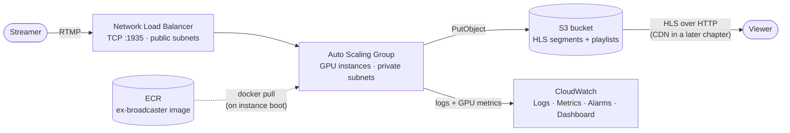

# Live Video Broadcasting: Deploying to AWS

This is the second article in a series on building a fully functional multimedia processing solution with [Membrane Framework](https://github.com/membraneframework).
The [first chapter](./1_building_multimedia_application_in_elixir.md) built the RTMP → transcode → HLS pipeline, wrapped it in an OTP application,
added an S3 storage backend, and packaged it as a release. This chapter takes that release to production on AWS.
The complete Terraform configuration referenced below lives in the `terraform/` directory of the same repository,
[membraneframework-labs/ex_broadcaster](https://github.com/membraneframework-labs/ex_broadcaster).

## What we'll build

By the end of this chapter, you will have:

- a Docker image of the release, built for `linux/amd64` and pushed to a private **ECR** repository;
- a fleet of GPU-capable EC2 instances running that image, managed by an **Auto Scaling Group** and reachable through a **Network Load Balancer** for RTMP ingest;
- the **S3 bucket** from chapter 1, now provisioned by Terraform alongside everything else;
- **CloudWatch** logs, GPU/host metrics, alarms, and a dashboard so you can actually tell whether the thing is healthy.

CDN configuration for global HLS distribution and richer application-level observability are large enough topics
to warrant their own chapters later in this series — here we focus on getting the broadcaster itself running reliably in the cloud.

### Why not Kubernetes

An earlier iteration of this project provisioned an EKS cluster with a GPU node group to run the broadcaster.
For this workload that turned out to be the wrong amount of machinery: each pipeline is a single independent process
tied to one RTMP connection, with no shared state besides the S3 bucket, and GPU passthrough on Kubernetes means
wiring up an NVIDIA device plugin and matching node group AMIs on top of the cluster control plane itself.
A plain Auto Scaling Group behind a load balancer gives us the same horizontal scaling with none of that —
one less control plane to pay for and operate. If you outgrow this later (multiple services, more complex
scheduling needs), revisiting Kubernetes is still an option, but it's not where you should start.

## Prerequisites

You will need:

- an AWS account, and the [AWS CLI v2](https://docs.aws.amazon.com/cli/latest/userguide/getting-started-install.html) installed and configured with a named profile
  that has permission to create VPCs, EC2/ASG/ELB resources, IAM roles, an ECR repository, an S3 bucket, and CloudWatch resources
  (for a personal tutorial account, attaching `AdministratorAccess` to your profile is the path of least resistance;
  in a shared account, scope it down to the equivalent service-level policies);
- [Terraform](https://developer.hashicorp.com/terraform/install) >= 1.5;
- [Docker](https://docs.docker.com/get-docker/) with `buildx` (bundled with recent Docker Desktop/Engine installs) —
  we need it to cross-compile the image for `linux/amd64` regardless of your local machine's architecture;
- the chapter 1 code, with the S3 storage backend wired in as described in [Adding S3 storage](./1_building_multimedia_application_in_elixir.md#adding-s3-storage).

One more permission is worth calling out separately: pushing images to ECR from your own machine requires your
*local* AWS profile to have `AmazonEC2ContainerRegistryPowerUser` (or broader). This is distinct from the
*instance role* the EC2 fleet runs under, which only needs read/pull access — that one is defined in Terraform
and covered below.

## Infrastructure overview



The Terraform configuration is split into one file per concern:

| File | Provisions |
| --- | --- |
| `providers.tf` | The `aws` provider, pinned to `var.aws_region` |
| `vpc.tf` | A VPC with public and private subnets across two AZs (chosen dynamically for the configured region), plus a NAT gateway |
| `security_groups.tf` | The security group attached to the instances (RTMP in, everything out) |
| `ecr.tf` | The ECR repository the image is pushed to, with a lifecycle policy |
| `iam.tf` | The instance role/profile: scoped S3 access, ECR pull, SSM, CloudWatch Agent |
| `s3.tf` | The HLS bucket, its public-read policy, and CORS configuration |
| `asg.tf` | The GPU launch template, Auto Scaling Group, and CPU-based scaling policy |
| `nlb.tf` | The Network Load Balancer and TCP target group for RTMP |
| `ssh.tf` | An SSH key pair for SSM Session Manager-tunnelled debugging access |
| `cloudwatch.tf` | Log groups, alarms, an SNS topic, and the monitoring dashboard |
| `user_data.sh.tpl` | The instance bootstrap script (installs Docker/NVIDIA/CloudWatch Agent, runs the container) |
| `variables.tf` | Everything above, parameterized |

We'll go through them roughly in the order you'd apply them, since a couple of things (the GPU quota, the ECR repository)
need to exist before the rest can come up cleanly.

## Requesting a GPU instance quota increase

New AWS accounts start with a **default quota of 0** for "Running On-Demand G and VT instances" in most regions —
this is the vCPU quota family that covers `g6.xlarge` (the instance type we use for Vulkan Video hardware-accelerated
transcoding). If you skip this step, the Auto Scaling Group will sit there failing to launch instances with an
opaque `VcpuLimitExceeded` error, so request the increase *before* you run `terraform apply`.

You can find the exact quota in the console under **Service Quotas → AWS services → Amazon EC2 → "Running On-Demand G and VT instances"**,
or request it directly from the CLI:

```sh
aws service-quotas request-service-quota-increase \
  --region <your-aws-region> --service-code ec2 --quota-code L-DB2E81BA \
  --desired-value 16
```

Request it in the same region you set as `aws_region` in `variables.tf` (see below) — quotas are per-region, so requesting an increase in the wrong one leaves the region you actually deploy to still at 0.

Size `--desired-value` for the vCPU count you actually need: a `g6.xlarge` has 4 vCPUs, so a value of 16 leaves
headroom for `asg_max_size = 3` instances plus a rolling instance refresh replacing one at a time. Adjust it (and
`instance_type`/`asg_max_size` in `variables.tf`) to match the instance family and fleet size you plan to run.

Check on the request's status with:

```sh
aws service-quotas get-requested-service-quota-change \
  --region <your-aws-region> --request-id <request-id-from-the-previous-command>
```

Approval is often instant but can take up to a day or two for larger increases — request it first, then move on to
the rest of the setup while you wait.

## Initializing Terraform

From the `terraform/` directory:

```sh
terraform init
```

This is a good moment to look at `variables.tf`, since every default in it is a deliberate choice you may want to override:

```hcl
# terraform/variables.tf
variable "aws_region"           { default = "eu-north-1" }  # override for any region — everything below follows
variable "instance_type"        { default = "g6.xlarge" }  # NVIDIA L4, matches Vulkan Video's HW acceleration needs
variable "asg_min_size"         { default = 1 }
variable "asg_max_size"         { default = 3 }
variable "asg_desired_capacity" { default = 1 }
variable "cpu_target_value"     { default = 60 }            # target-tracking scaling threshold
variable "root_volume_size_gb"  { default = 80 }
variable "app_image_tag"        { default = "latest" }
variable "s3_prefix"            { default = "hls" }
variable "log_retention_days"   { default = 14 }
variable "alarm_email"          { default = "" }            # set to get alarm emails via SNS
```

`aws_region` is the single source of truth for where everything gets deployed — `providers.tf` passes it straight
into the `aws` provider block (`provider "aws" { region = var.aws_region }`), and `vpc.tf` picks its two
availability zones dynamically via the `aws_availability_zones` data source rather than hardcoding AZ names tied
to one region. To deploy elsewhere, override it (e.g. `terraform apply -var="aws_region=us-east-1"`, or set it in
a `terraform.tfvars` file) — just make sure `g6.xlarge` (or whichever `instance_type` you choose) is actually
offered there, and that you request the GPU quota increase above in that same region.

State is kept locally for this tutorial (`.gitignore` already excludes `*.tfstate*`, `.pem` key files, and
`terraform.tfvars` so you don't accidentally commit secrets) — for a team setup you'd point this at a remote
backend (e.g. S3 + DynamoDB locking) instead, but that's outside the scope of this chapter.

## Provisioning the ECR repository

The Auto Scaling Group's launch template needs to reference an image URL that already exists, and we need
somewhere to push our image *before* any instance boots — so create just the ECR repository first:

```sh
terraform apply -target=aws_ecr_repository.ex_broadcaster
```

```hcl
# terraform/ecr.tf
resource "aws_ecr_repository" "ex_broadcaster" {
  name                 = "ex-broadcaster"
  image_tag_mutability = "MUTABLE"

  image_scanning_configuration {
    scan_on_push = true
  }
}

resource "aws_ecr_lifecycle_policy" "ex_broadcaster" {
  repository = aws_ecr_repository.ex_broadcaster.name

  policy = jsonencode({
    rules = [{
      rulePriority = 1
      description  = "Expire untagged images after 7 days"
      selection    = { tagStatus = "untagged", countType = "sinceImagePushed", countUnit = "days", countNumber = 7 }
      action       = { type = "expire" }
    }]
  })
}
```

`scan_on_push` gets you a basic vulnerability scan of the base image and its OS packages on every push, and the
lifecycle policy keeps the repository from accumulating untagged images left behind by repeated pushes to `:latest`.

## Building and pushing the image

Chapter 1's `Dockerfile` builds the release in an `hexpm/elixir` builder stage and copies it into an
`nvcr.io/nvidia/cuda` runtime stage so the container has the CUDA/Vulkan userspace libraries the transcoder needs
at runtime; the NVIDIA driver itself is installed on the *host* (we'll get to that in `user_data.sh.tpl`) and
exposed into the container via `--gpus all`.

Authenticate Docker against your new ECR repository:

```sh
aws ecr get-login-password --region <your-aws-region> \
  | docker login --username AWS --password-stdin <account-id>.dkr.ecr.<your-aws-region>.amazonaws.com
```

(`<account-id>` is your AWS account ID — `aws sts get-caller-identity` prints it — and `<your-aws-region>` is
whatever you set `aws_region` to in `variables.tf`. Simplest option: just copy both straight out of the
`ecr_repository_url` Terraform output from the previous step, which already has the full URL.)

Then build and push, explicitly targeting `linux/amd64` — the EC2 fleet runs on x86_64, and if you're building
from an Apple Silicon Mac (or any non-amd64 machine) a plain `docker build` would otherwise produce an image the
instances can't run:

```sh
docker buildx build \
  --platform linux/amd64 \
  -t <account-id>.dkr.ecr.<your-aws-region>.amazonaws.com/ex-broadcaster:latest \
  --push .
```

`--push` uploads the image directly from the build without a separate `docker push` step. Expect this build to
take a while the first time — it's compiling Membrane's native dependencies (FFmpeg, Vulkan headers) from source
inside the builder stage.

## Provisioning the rest of the infrastructure

With the image in ECR, bring up everything else:

```sh
terraform apply
```

A few of these resources are worth understanding before you run it.

### Networking and security

`vpc.tf` provisions a VPC (via the community `terraform-aws-modules/vpc/aws` module) with public subnets for the
load balancer and private subnets for the instances, connected through a single NAT gateway so the instances can
reach ECR/S3/SSM without a public IP of their own:

```hcl
# terraform/vpc.tf
data "aws_availability_zones" "available" {
  state = "available"
}

module "vpc" {
  source  = "terraform-aws-modules/vpc/aws"
  version = "~> 5.0"

  name = "ex-broadcaster-vpc"
  cidr = "10.0.0.0/16"

  azs             = slice(data.aws_availability_zones.available.names, 0, 2)
  private_subnets = ["10.0.1.0/24", "10.0.2.0/24"]
  public_subnets  = ["10.0.101.0/24", "10.0.102.0/24"]

  enable_nat_gateway = true
  single_nat_gateway = true
}
```

The `aws_availability_zones` data source picks its two AZs from whichever region the provider is configured for
(`providers.tf` sets `provider "aws" { region = var.aws_region }`), instead of hardcoding AZ names from one
specific region — so changing `var.aws_region` is genuinely enough to redeploy the whole stack somewhere else.

`security_groups.tf` opens only what's needed: port 1935 (RTMP) from anywhere — it has to stay world-open since
the NLB preserves the client's source IP rather than presenting its own — and no inbound SSH at all. Debugging
access goes over an SSM Session Manager tunnel instead (`ssh.tf`), so there's no port 22 exposure to manage or
forget about; `iam.tf` attaches `AmazonSSMManagedInstanceCore` to the instance role and the Ubuntu AMI ships the
SSM Agent preinstalled, so no extra bootstrapping is required. If you do need a shell:

```sh
terraform output -raw ssh_private_key_pem > ex-broadcaster.pem && chmod 400 ex-broadcaster.pem
aws ssm start-session --target <instance-id> \
  --document-name AWS-StartSSHSession --parameters portNumber=22
```

### The instance role

`iam.tf` defines a single role attached to every instance in the fleet, scoped to exactly what the application
and its bootstrap script need:

```hcl
# terraform/iam.tf
resource "aws_iam_role_policy" "hls_bucket_access" {
  # s3:GetObject / PutObject / DeleteObject on the HLS bucket's objects, s3:ListBucket on the bucket itself
}

resource "aws_iam_role_policy_attachment" "ecr_read_only" {
  policy_arn = "arn:aws:iam::aws:policy/AmazonEC2ContainerRegistryReadOnly"
}

resource "aws_iam_role_policy_attachment" "ssm_core" {
  policy_arn = "arn:aws:iam::aws:policy/AmazonSSMManagedInstanceCore"
}

resource "aws_iam_role_policy_attachment" "cloudwatch_agent" {
  policy_arn = "arn:aws:iam::aws:policy/CloudWatchAgentServerPolicy"
}
```

Because the instance has S3 access via this role, `ex_aws`'s default credential chain picks it up automatically
through the instance metadata service — the application never needs static `AWS_ACCESS_KEY_ID`/`AWS_SECRET_ACCESS_KEY`
values in production, only `AWS_REGION`, `S3_BUCKET`, and `S3_PREFIX` (set in the `docker run` command in
`user_data.sh.tpl`, see below).

### The S3 bucket

`s3.tf` provisions the same bucket chapter 1's `S3Storage` writes to, now as part of the infrastructure instead of
something you created by hand:

```hcl
# terraform/s3.tf
resource "aws_s3_bucket" "hls" {
  bucket = "ex-broadcaster-hls-${data.aws_caller_identity.current.account_id}"
}
```

It's configured with a public-read bucket policy (scoped to `s3:GetObject` only — nobody can list or write
without the instance role's credentials) and a permissive CORS rule for `GET`/`HEAD`, mirroring the CORS behavior
of the development HTTP server from chapter 1 so `hls.js`-based players work against the bucket directly.

### The GPU launch template and Auto Scaling Group

`asg.tf` is the centerpiece — it defines what an instance looks like and how many of them should run:

```hcl
# terraform/asg.tf
resource "aws_launch_template" "ex_broadcaster" {
  image_id      = data.aws_ssm_parameter.ubuntu_ami.value  # plain Ubuntu 22.04, no NVIDIA driver preinstalled
  instance_type = var.instance_type                        # g6.xlarge
  iam_instance_profile { name = aws_iam_instance_profile.ex_broadcaster.name }
  vpc_security_group_ids = [aws_security_group.instance.id]

  user_data = base64encode(templatefile("${path.module}/user_data.sh.tpl", { ... }))
}

resource "aws_autoscaling_group" "ex_broadcaster" {
  vpc_zone_identifier = module.vpc.private_subnets
  min_size            = var.asg_min_size
  max_size            = var.asg_max_size
  desired_capacity    = var.asg_desired_capacity
  health_check_type   = "ELB"
  target_group_arns   = [aws_lb_target_group.rtmp.arn]

  instance_refresh {
    strategy    = "Rolling"
    preferences = { min_healthy_percentage = 50, instance_warmup = 300 }
  }
}

resource "aws_autoscaling_policy" "cpu_target_tracking" {
  policy_type = "TargetTrackingScaling"
  target_tracking_configuration {
    predefined_metric_specification { predefined_metric_type = "ASGAverageCPUUtilization" }
    target_value = var.cpu_target_value
  }
}
```

Two things worth flagging, both left as known limitations rather than hidden:

- **Scaling is CPU-based, but the workload is GPU-bound.** Vulkan Video hardware transcoding barely touches the
  CPU, so `ASGAverageCPUUtilization` is a weak proxy for actual capacity. The `gpu_utilization_high` alarm
  (see [Monitoring](#monitoring) below) exists specifically to catch the case where GPU utilization is pegged
  while CPU-based scaling sees no reason to add capacity — treat it as a signal to raise `cpu_target_value`,
  lower it, or move to a custom GPU-utilization-driven scaling policy once you have real traffic patterns to tune against.
- **Scale-in has no graceful drain.** RTMP connections are long-lived; an instance refresh or scale-in event
  terminates whatever streams happen to be running on that instance with no warning. A production setup would add
  an `aws_autoscaling_lifecycle_hook` that waits for zero active pipelines (the application already tracks this
  via `DynamicSupervisor.count_children/1`) before allowing termination.

### The load balancer

`nlb.tf` fronts the fleet with a Network Load Balancer doing plain TCP passthrough on port 1935 — RTMP isn't HTTP,
so this has to be a Layer 4 balancer, not an ALB:

```hcl
# terraform/nlb.tf
resource "aws_lb" "rtmp" {
  load_balancer_type                = "network"
  subnets                            = module.vpc.public_subnets
  enable_cross_zone_load_balancing  = true  # otherwise the AZ without a healthy target fails ~50% of connections
}

resource "aws_lb_target_group" "rtmp" {
  port                  = 1935
  protocol              = "TCP"
  deregistration_delay  = 120  # give in-flight streams a chance to finish before a target is fully deregistered
}
```

## Instance bootstrap

`user_data.sh.tpl` runs once on first boot and does everything needed to turn a bare Ubuntu AMI into a running
broadcaster node:

1. installs and starts Docker;
2. installs the NVIDIA driver and the NVIDIA Container Toolkit (so `docker run --gpus all` works), skipping this
   if they're already present in a custom AMI;
3. installs and configures the CloudWatch Agent from the templated JSON config (host/GPU metrics + log tailing —
   more on this below);
4. installs the AWS CLI, authenticates Docker against ECR, and pulls the image;
5. runs the container:

```sh
# terraform/user_data.sh.tpl
docker run -d \
  --name ex-broadcaster \
  --restart unless-stopped \
  --gpus all \
  --log-driver=awslogs \
  --log-opt awslogs-region="$AWS_REGION" \
  --log-opt awslogs-group="$APP_LOG_GROUP" \
  --log-opt awslogs-stream="$INSTANCE_ID" \
  --log-opt awslogs-create-group=false \
  -p 1935:1935 \
  -p 127.0.0.1:8080:8080 \
  -e AWS_REGION="$AWS_REGION" \
  -e S3_BUCKET="$S3_BUCKET" \
  -e S3_PREFIX="$S3_PREFIX" \
  "$IMAGE"
```

A couple of details worth calling out: the container's stdout/stderr go straight to CloudWatch Logs via Docker's
own `awslogs` log driver, no sidecar needed. And port 8080 — the development HTTP server from chapter 1 — is only
bound to `127.0.0.1`, not exposed to the NLB or the internet; in production, HLS is served from S3 (directly, or
through a CDN in front of it), so the in-process HTTP server has no reason to be reachable from outside the instance.

## Verifying the deployment

Once `terraform apply` finishes, grab the outputs:

```sh
terraform output rtmp_ingest_endpoint       # rtmp://<nlb-dns-name>:1935
terraform output hls_bucket_url             # https://<bucket>.s3.<region>.amazonaws.com
terraform output cloudwatch_dashboard_url
```

Point a test stream at the NLB, same as in chapter 1 but now against the load balancer instead of `localhost`:

```sh
ffmpeg -re -f lavfi -i testsrc=size=1280x720:rate=30 -f lavfi -i sine=frequency=1000 \
  -c:v libx264 -preset veryfast -tune zerolatency -pix_fmt yuv420p -c:a aac \
  -f flv rtmp://<nlb-dns-name>:1935/ex_broadcaster/key
```

The stream should show up shortly after in the bucket, under the date-partitioned prefix from chapter 1's
`build_storage/1`:

```
<hls_bucket_url>/hls/<year>/<month>/<day>/<hour>/key/index.m3u8
```

If nothing shows up, the CloudWatch log groups set up next are the fastest way to find out why.

## Monitoring

`cloudwatch.tf` sets up logs, metrics, alarms, and a dashboard so you don't have to SSM into an instance to know
whether the system is healthy.

### Logs

Two log groups are created, both with `log_retention_days` (default 14 days) retention:

```hcl
# terraform/cloudwatch.tf
resource "aws_cloudwatch_log_group" "app"    { name = "/ex-broadcaster/app" }
resource "aws_cloudwatch_log_group" "system" { name = "/ex-broadcaster/system" }
```

`/ex-broadcaster/app` receives the application's own stdout/stderr (Elixir/Membrane logs) via Docker's `awslogs`
driver, one stream per instance ID. `/ex-broadcaster/system` receives the CloudWatch Agent's tail of
`/var/log/ex-broadcaster-user-data.log` (so a failed bootstrap is visible without a shell) and `/var/log/syslog`,
per `amazon-cloudwatch-agent.json.tpl`'s `logs.logs_collected.files` section.

### Metrics

The same CloudWatch Agent config also collects host and, importantly, **GPU** metrics under a custom
`ExBroadcaster` namespace, dimensioned by instance ID and ASG name:

```json
// terraform/amazon-cloudwatch-agent.json.tpl
"metrics_collected": {
  "mem":  { "measurement": ["mem_used_percent"] },
  "disk": { "measurement": ["used_percent"], "resources": ["/"] },
  "nvidia_gpu": {
    "measurement": [
      "utilization_gpu", "utilization_memory", "memory_used", "memory_total",
      "temperature_gpu", "power_draw",
      "encoder_stats_session_count", "encoder_stats_average_fps", "encoder_stats_average_latency"
    ]
  }
}
```

The `encoder_stats_*` metrics come straight from `nvidia-smi`'s NVENC session accounting, and are the closest
thing to a direct measurement of "how much transcoding work is this box actually doing" — far more meaningful
here than CPU, for the reasons covered above.

### Alarms

Three alarms feed a shared SNS topic (`aws_sns_topic.alarms`), with an optional email subscription if you set
`alarm_email`:

- **`unhealthy-targets`** — any RTMP target failing NLB health checks; the fastest signal that a specific
  instance has gone bad, ahead of the ASG's own health-check-driven replacement.
- **`no-healthy-targets`** — zero healthy targets left, i.e. a full ingest outage, distinct from "some targets
  are unhealthy."
- **`gpu-utilization-high`** — sustained GPU utilization above 95% for 15 minutes; not an outage, but a heads-up
  that the fleet is close to its real capacity ceiling even if CPU-based scaling hasn't kicked in.

### Dashboard

`aws_cloudwatch_dashboard.ex_broadcaster` lays out four widgets — GPU utilization, NVENC encoder
sessions/fps, ASG CPU utilization, and NLB healthy/unhealthy target counts — on one screen. The
`cloudwatch_dashboard_url` output links straight to it in the console; it's the first thing worth checking after
starting a test stream, and the first thing worth checking if a viewer reports a problem.

## Cleaning up

GPU instances are not cheap, and this stack also runs a NAT gateway around the clock. When you're done
experimenting:

```sh
terraform destroy
```

Note that this will not empty the S3 bucket first if it contains objects — either empty it manually
(`aws s3 rm s3://<bucket> --recursive`) or add a `force_destroy = true` to `aws_s3_bucket.hls` before destroying
if you don't need to keep the recordings.

## What's next

The broadcaster now runs on real infrastructure, with autoscaling, GPU acceleration, and enough observability to
know when something's wrong. What's still missing from the original roadmap is global distribution — right now,
viewers fetch HLS segments directly from a single-region S3 bucket, which works but isn't how you'd serve a
worldwide audience with low latency. That's the subject of the next chapter: putting a CDN in front of this bucket.
